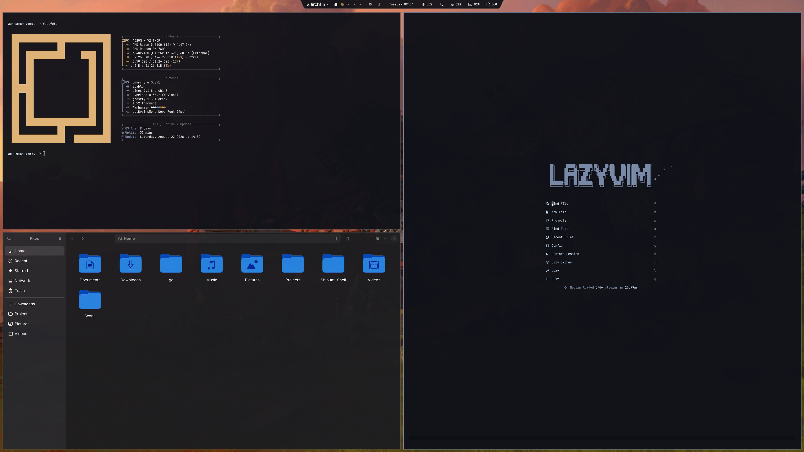

|  |  |
| -------------------------------------- | --------------------------------------- |


# Installation

### TERMINAL INSTALL


```
omarchy-theme-install https://github.com/MickyMouse101/omarchy-warhammer_40k-theme.git
```

### MENU INSTALL


1. Copy this link: `https://github.com/MickyMouse101/omarchy-warhammer_40k-theme.git`
2. Open the Menu, `SUPER+SPACE`, navigate to: Install < Style < Theme
3. Paste: `CTRL+SHIFT+V`, then press enter/return.


### PLUG-INS USED:


- Shibumi
- Omatype 
